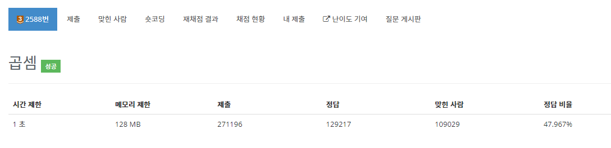
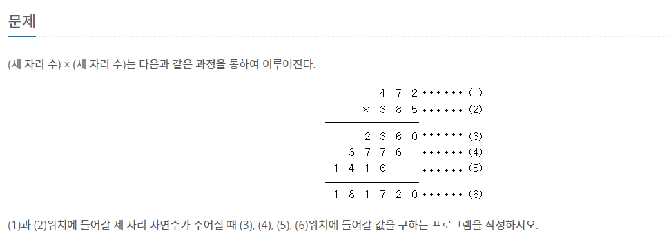
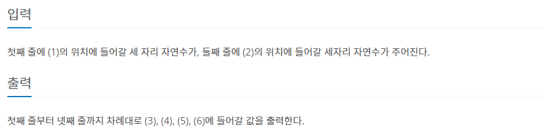

# Scanner
자바에서는 입력을 받기 위해 Scanner 클래스를 이용할 수 있다.<br><br>
```java
import java.util.*;
import java.util.Scanner;
```
util 패키지 안의 모든 클래스를 사용한다는 util.* 을 가져와도 되고,<br>
Scanner 클래스를 사용한다고 직접적으로 알려주기 위해 util.Scanner 를 가져와도 된다.<br><br>

Scanner 클래스의 객체를 생성하고 해당 객체를 사용하여 변수에 값을 입력받을 수 있다.<br><br>

```java
Scanner scanner = new Scanner(System.in);

String name = scanner.nextLine();
int age = scanner.nextInt();
//String ageInput = scanner.nextLine();
//int age = Integer.parseInt(ageInput);
```

<br><br>
scanner 객체를 이용해 name과 age에 각 각 값을 입력하였다.<br>
nextLine()은 입력대기 상태에서 엔터키를 누르면 입력한 내용이 문자열로 반환된다.

 

Integer.parseInt() 메서드는 입력받은 문자열을 int타입으로 변환하여 할당시키는 역할을 한다.<br>
nextInt() 메서드는 위와 같은 추가 연산 없이 입력받은 값을 바로 int형으로 변환시킬 수 있다.<br>
하지만 연속적으로 값을 입력받기 까다로울 수 있으니 그럴 땐 문자열을 한번에 받아 형변환을 하는 방법을 선택할 수 있다.<br><br><br>

---
<br><br>



<br><br>
두 수를 입력받아 나누기 연산을 통해 각 자릿수를 구했다.<br>
그리고 곱하기를 통해 출력을 진행하였다.
<br><br>
```java
public static void main(String[] args) {
        Scanner scanner = new Scanner(System.in);
        int num1 = scanner.nextInt();
        int num2 = scanner.nextInt();

        int one = num2%10;
        int ten = num2%100/10;
        int hun = num2/100;

        System.out.println(num1*one);
        System.out.println(num1*ten);
        System.out.println(num1*hun);
        System.out.println(num1*num2);
    }
```